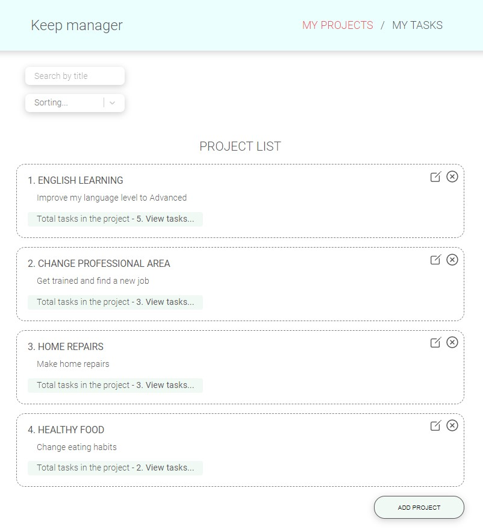
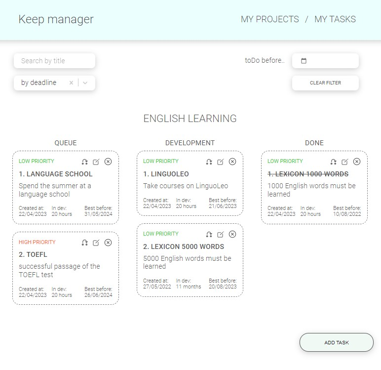

# Pet project - Keep manager app

This is an educational project Keep manager application (like SPA TODO)

The application contains two pages:
- project selection page;
- page with tasks.
Most of the action happens in a modal.

The page with tasks contains three columns with the ability to change the status using drag-n-drop:
- queue;
- development;
- done.

Each task has:
- task number;
- header;
- description;
- date of creation;
- time at work;
- expiration date;
- priority;
- current status.

Implemented the ability to create and edit a tasks and projects.

The application has the ability to filter lists by search queries and deadline date.

Application uses localStorage to save data.

The main topics of study in the project is React, React hooks, Redux. 

## Screenshot

## Links

- Live Site URL: [Keep manager app](https://keep_manager.vercel.app/)

## Built with

- JavaScript
- React
- React hooks
- redux
- localStorage
- router-dom
- react-select
- react-transition-group
- date-fns

